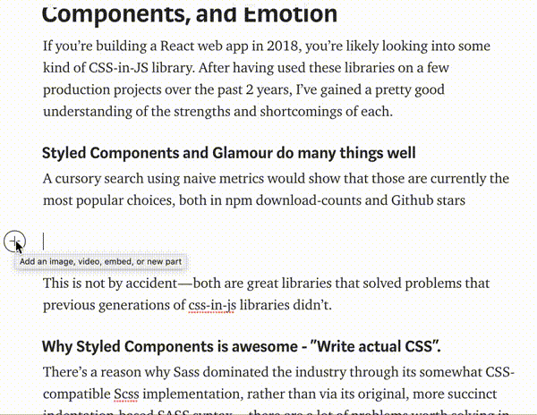
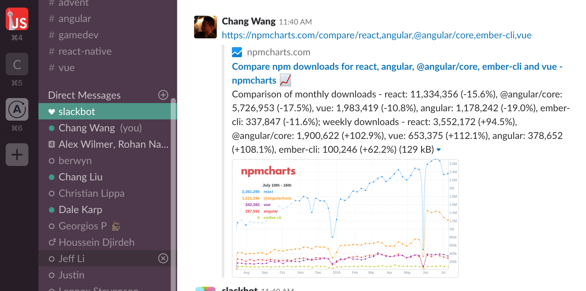

### Hidden features

A few things that might not be apparent just by looking at the site

- Charts can be embedded in Medium articles  

  

- Tweets of a chart should contain previews of the actual chart

  

- Same with slack  

  

### Thanks to

- npm for making their data available to hack on
- [Chromatic](https://www.chromaticqa.com/) for providing component screenshot testing
- [Embed.ly](https://embed.ly/) for bringing npmcharts embeds to Medium and Reddit